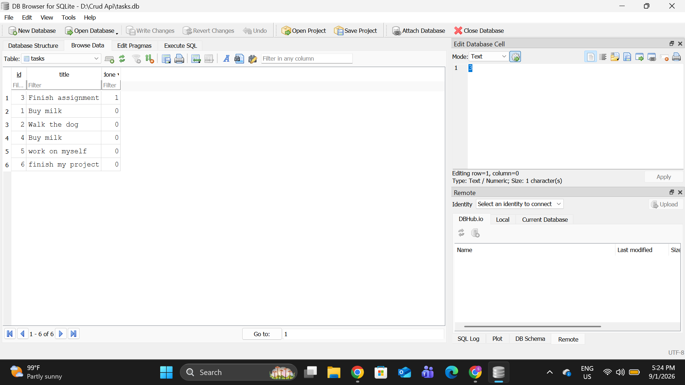

# Task API

A CRUD API for managing a to-do list, built with Node.js and Express as part of the FlyRank Backend Internship. This started in Week 2 (Assignment A1) as an in-memory API, and in Week 3 (Assignment A2) its storage was moved to a real SQLite database — the endpoints behave exactly the same, but the data now survives a server restart.

## What this is

A REST API that lets you create, read, update, and delete tasks. Tasks are stored in a SQLite database file (`tasks.db`), created automatically the first time the server runs.

## Why SQLite

SQLite was chosen because it fits a small project like this one perfectly:

- **Single file** — the entire database is one file, `tasks.db`. No server process to install, configure, or keep running.
- **Zero setup** — the `better-sqlite3` library creates the file the moment the app connects to it. There's nothing to provision.
- **Survives restarts** — unlike the in-memory array from Assignment 1, data written to `tasks.db` is still there the next time the server starts.

## Where the database lives

The database file is `tasks.db` in the project root. It is created automatically the first time you run `npm start` — you don't need to create it by hand. It's listed in `.gitignore`, so it is **not** committed to the repo; each fresh clone starts with no `tasks.db` file, and the app creates one (with the table and the 3 seeded tasks) the moment it starts.

## How to install & run

```bash
npm install
npm start
```

The server starts at `http://localhost:3000`. Interactive docs (Swagger UI) are at `http://localhost:3000/docs`.

On first run, the `tasks` table is created and seeded with 3 example tasks. On every run after that, the seed check sees existing rows and skips seeding, so restarting never duplicates the examples.

## Endpoints

| Method | Path         | Description                | Success | Errors        |
|--------|--------------|-----------------------------|---------|----------------|
| GET    | /            | API info                    | 200     | —              |
| GET    | /health      | Health check                | 200     | —              |
| GET    | /tasks       | List all tasks              | 200     | —              |
| GET    | /tasks/:id   | Get a single task           | 200     | 404            |
| POST   | /tasks       | Create a task                | 201     | 400 (bad title)|
| PUT    | /tasks/:id   | Update a task's title/done  | 200     | 400, 404       |
| DELETE | /tasks/:id   | Delete a task                | 204     | 404            |

## Example: curl output

```
$ curl -i -X POST http://localhost:3000/tasks -H "Content-Type: application/json" -d '{"title":"Buy milk"}'

HTTP/1.1 201 Created
Content-Type: application/json; charset=utf-8

{"id":4,"title":"Buy milk","done":false}
```

## Database schema

The `tasks` table has three columns:

| Column | Type    | Notes                          |
|--------|---------|---------------------------------|
| id     | INTEGER | primary key, assigned by SQLite |
| title  | TEXT    | the task's title                |
| done   | BOOLEAN | stored as 0 / 1                 |

## Exploring the database by hand (Stage 4)

Opening `tasks.db` in [DB Browser for SQLite](https://sqlitebrowser.org/) lets you see and query the exact same data the API serves — there's no syncing, since the API and DB Browser both read the one file on disk.

Example query run in DB Browser's "Execute SQL" tab:

```sql
SELECT COUNT(*) FROM tasks;
```

**Result:** returned `6` — the 3 seeded tasks plus 3 more created afterwards through the API while testing (`POST /tasks`), which is expected since seeding only runs once, the first time the table is empty.

### Database screenshot

`tasks.db` open in DB Browser for SQLite, "Browse Data" tab, showing the `tasks` table:



## Proving persistence

Create a task via `POST /tasks`, stop the server, start it again with `npm start`, then call `GET /tasks`. The task created before the restart is still there — this is the entire point of moving from an in-memory array to SQLite: the data now lives on disk instead of in the program's memory, so restarting the process doesn't erase it.
